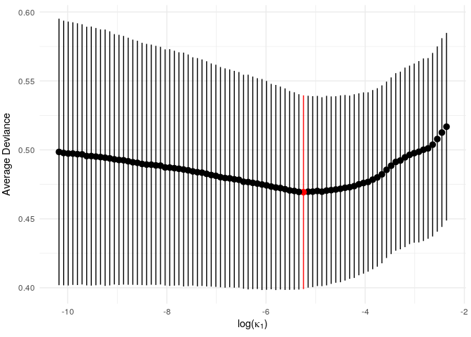
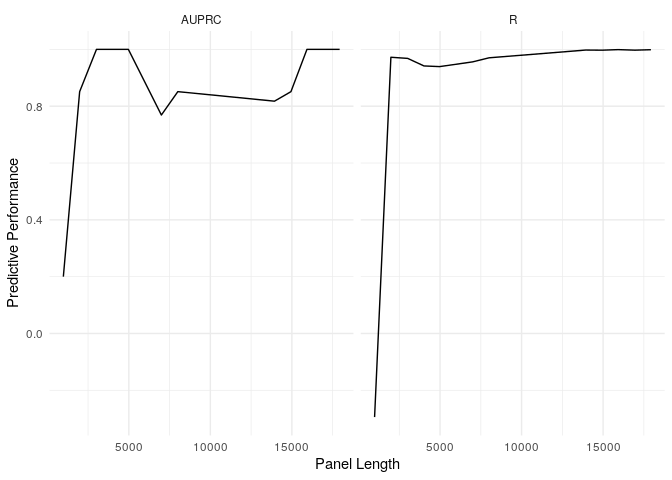

<!-- README.md is generated from README.Rmd. Please edit that file -->

# ICBioMark

<!-- badges: start -->
[](https://github.com/cobrbra/ICBioMark/actions)
<!-- badges: end -->

Welcome to ICBioMark, based on the paper “Data-driven design of targeted
gene panels for estimating immunotherapy biomarkers”, *Bradley and
Cannings* (see our [preprint](https://arxiv.org/abs/2102.04296)).

## Installation

<!-- You can install the development version of ICBioMark from [CRAN](https://CRAN.R-project.org) with: -->

You can install the development version of this package from this github
repository (using the
[devtools](https://CRAN.R-project.org/package=devtools) package) with:

``` r
devtools::install_github("cobrbra/ICBioMark")
```

## Examples

Upon installation we can load the package.

``` r
library(ICBioMark)
```

To demonstrate the typical workflow for using ICBioMark, we play around
with a small and friendly example dataset. This is pre-loaded with the
package, but just comes from the data simulation function
`generate_maf_data()`, so you can play around with datasets of different
sizes and shapes.

### Input Data

Our example dataset, called `example_maf_data`, is a list with two
elements: `maf` and `gene_lengths`. These are the two pieces of data
that you’ll always need to use this package, and they look as follows:

-   `maf` is a data frame in the MAF (mutation annotated format) style.
    For a set of sequenced tumour/normal pairs, this means a table with
    a row for every mutation identified, with columns corresponding to
    properties such as the sample ID for the tumour of origin, the gene,
    chromosome and nucelotide location of the mutation, and the type of
    mutation observed. In the real world, MAF datasets often have lots
    of extra information beyond this, but in our small example we’ve
    just included sample, gene and mutation type (it’s all we’ll need!).
    The top five rows look like this:

``` r
 # example_maf_data <- generate_maf_data()

 kable(head(example_maf_data$maf, 5), row.names = FALSE)
```

| Tumor\_Sample\_Barcode | Hugo\_Symbol | Variant\_Classification |
|:-----------------------|:-------------|:------------------------|
| SAMPLE\_96             | GENE\_14     | Missense\_Mutation      |
| SAMPLE\_73             | GENE\_14     | Frame\_Shift\_Ins       |
| SAMPLE\_55             | GENE\_4      | Missense\_Mutation      |
| SAMPLE\_96             | GENE\_3      | Missense\_Mutation      |
| SAMPLE\_38             | GENE\_7      | Missense\_Mutation      |

-   `gene_lengths`, another data frame, this time containing the names
    of genes that you’ll want to include in your modelling and their
    length. Gene length is a complex and subtle thing to define - we
    advise using coding length as defined in the
    [Ensembl](https://www.ensembl.org/index.html) database. For this
    example, however, gene lengths are again randomly chosen:

``` r
  kable(head(example_maf_data$gene_lengths, 5), row.names = FALSE)
```

| Hugo\_Symbol | max\_cds |
|:-------------|---------:|
| GENE\_1      |      961 |
| GENE\_2      |     1009 |
| GENE\_3      |     1011 |
| GENE\_4      |      976 |
| GENE\_5      |     1016 |

These are the only two bits of data required to use ICBioMark. Your gene
lengths data can contain values for far more genes than are observed in
your dataset, and it’s not a huge problem if a couple of genes in a
Whole-Exome Sequencing (WES) experiment are missing gene length
information, but lots of missing values will cause issues with your
model accuracy. Later versions of this package should be able to address
missing gene length data.

### Train/Val/Test and Matrix Construction

The MAF format is widely used and standardised, but not especially
helpful for our purposes. The ideal format for our data is a matrix,
where every row corresponds to a sample, every column corresponds to a
gene/mutation type combination, and each entry corresponds to how many
mutations of that sample, gene and type were sequenced. At the same time
as this, we’d like to separate our training data from separately
reserved validation and test data. We do this using the function
`get_mutation_tables()`.

Before we do this, however, we need to talk about mutation types. Our
procedure models different mutation types separately, so in theory one
could have separate parameters for each mutation type
(e.g. ‘Missense\_Mutation’ or ‘Frame\_Shift\_Ins’). However, doing so
will vastly increase the computational complexity of fitting a
generative model. It is also not particularly informative to fit
parameters to extremely scarce mutation types. We therefore group
mutation types together (and can filter some out if we don’t want to
include them in our modelling). This will happen behind-the-scenes, but
is worth knowing about to understand the outputs generated. Mutations
types are grouped and filtered by the function
`get_mutation_dictionary()`. In general we recommend separately
modelling indel mutations (so that we can predict TIB later), synonymous
mutations (as these don’t count towards TMB or TIB), and lumping
together all other nonsynonymous mutation types. The function
`get_mutation_dictionary()` produces a list of mutation types, with
labels for their groupings. For example:

``` r
  kable(get_mutation_dictionary(), col.names = "Label")
```

|                          | Label |
|:-------------------------|:------|
| Missense\_Mutation       | NS    |
| Nonsense\_Mutation       | NS    |
| Splice\_Site             | NS    |
| Translation\_Start\_Site | NS    |
| Nonstop\_Mutation        | NS    |
| In\_Frame\_Ins           | NS    |
| In\_Frame\_Del           | NS    |
| Frame\_Shift\_Del        | I     |
| Frame\_Shift\_Ins        | I     |
| Silent                   | S     |
| Splice\_Region           | S     |
| 3’Flank                  | S     |
| 5’Flank                  | S     |
| Intron                   | S     |
| RNA                      | S     |
| 3’UTR                    | S     |
| 5’UTR                    | S     |

We’ve given each mutation type one of three labels: “NS”, “S” and “I”.
We could have excluded synonymous mutation types by using
`get_mutation_dictionary(include_synonymous = FALSE)`.

Now we can produce our training, validation and test sets (again for
this example workflow these are pre-loaded). The object produced has
three elements: ‘train’, ‘val’ and ‘test’. Each of these contains a
sparse mutation matrix (‘matrix’) and other information describing the
contents of the matrix (‘sample\_list’, ‘gene\_list’, ‘mut\_types\_list’
and ‘col\_names’). We can see that the list of mutation types contains
the three labels we specified above

``` r
  #example_tables <- get_mutation_tables(example_maf_data$maf, 
  #                   sample_list = paste0("SAMPLE_", 1:100))

  print(example_tables$train$mut_types_list)
#> [1] "NS" "I"  "S"
```

and that the columns of each matrix correspond to each combination of
mutation type and gene:

``` r
  print(head(example_tables$train$col_names, 10))
#>  [1] "GENE_1_NS" "GENE_1_I"  "GENE_1_S"  "GENE_2_NS" "GENE_2_I"  "GENE_2_S" 
#>  [7] "GENE_3_NS" "GENE_3_I"  "GENE_3_S"  "GENE_4_NS"
```

### Fitting the Generative Model

There are relatively few decisions left to be made at this point: all we
need to do to fit a generative model is to provide gene lengths data and
training data to the function `fit_gen_model()`. We can visualise output
of our model with `vis_model_fit()`.

``` r
  # example_gen_model <- fit_gen_model(example_maf_data$gene_lengths, 
  #                       table = example_tables$train)

  print(vis_model_fit(example_gen_model))
```



Since this is a small example, we don’t get a particularly strong
signal, but we do see an optimum level of penalisation. (NB: the
function `vis_model_fit()` essentially performs the same task as
`glmnet::plot.cv.glmnet()`. In later versions the `glmnet` version will
hopefully be directly applicable and `vis_model_fit()` will be
redundant).

### Fitting the Predictive Model

We now construct a first-fit predictive model. The parameter `lambda`
controls the sparsity of each iteration, so it may take some
experimentation to get a good range of panel lengths.

``` r
  example_first_pred_tmb <- pred_first_fit(example_gen_model, 
    lambda = exp(seq(-9, -14, length.out = 100)), 
    training_matrix = example_tables$train$matrix, 
    gene_lengths = example_maf_data$gene_lengths)
```

From this we can construct a range of refit estimators:

``` r
  example_refit_range <- pred_refit_range(pred_first = example_first_pred_tmb, 
    gene_lengths = example_maf_data$gene_lengths)
```

### Making Predictions and Analysing Performance

With a predictive model fitted, we can use the function
`get_predictions()` along with a new (validation or test) dataset to
produce predictions on that dataset. We then provide several functions
including `get_stats()` to analyse the output compared to true values.

``` r
  example_refit_range %>% 
     get_predictions(new_data = example_tables$val) %>% 
     get_stats(biomarker_values = example_tmb_tables$val, model = "T", threshold = 10) %>% 
     ggplot(aes(x = panel_length, y = stat)) + geom_line() + facet_wrap(~metric) + theme_minimal() + labs(x = "Panel Length", y = "Predictive Performance")
```



## Getting Help

Please do feel free to flag issues and requests on this repository. You
can also [email](mailto:cobrbradley@gmail.com) me.
